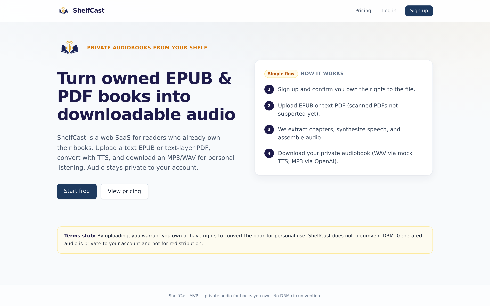
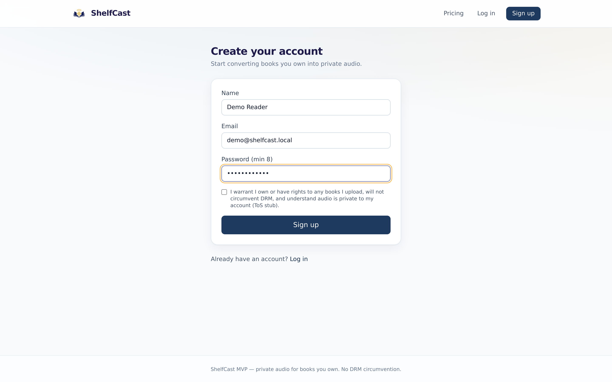
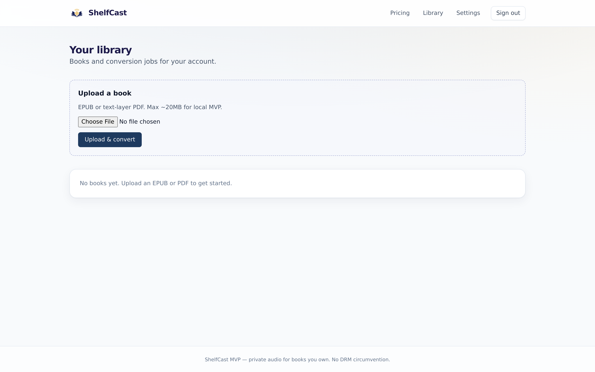
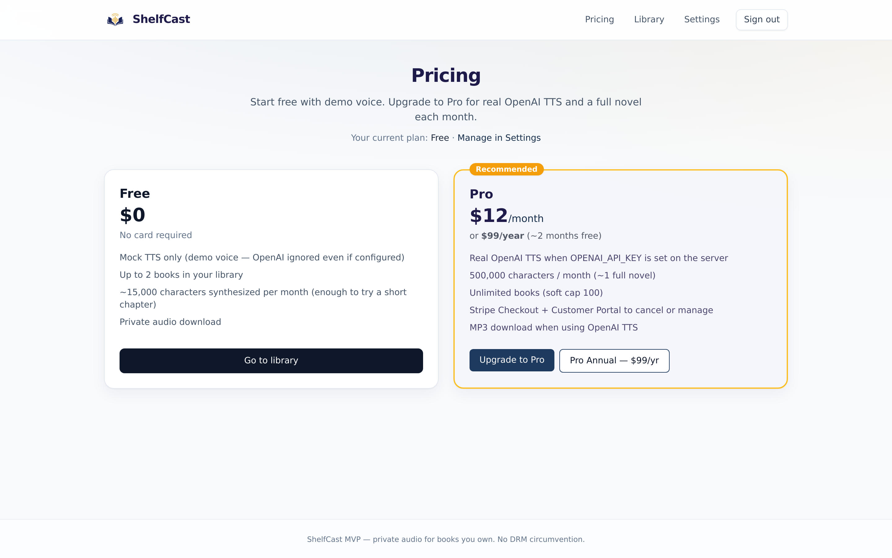

# ShelfCast

**Turn books you already own into private, downloadable audiobooks.**

ShelfCast is a production-oriented web SaaS: upload owned EPUB or text-layer PDF files, enqueue TTS conversion on a DB-backed worker, and download MP3/WAV audio that stays private to your account. No DRM circumvention — only files you have rights to convert.

## Screenshots

| Landing | Sign up |
| --- | --- |
|  |  |

| Library | Pricing |
| --- | --- |
|  |  |

## Architecture

- **Next.js 15** (App Router, `output: 'standalone'`) + TypeScript + Tailwind
- **Auth.js / NextAuth v4** — email + password and Google OAuth, JWT sessions (Prisma adapter for Account linking)
- **Prisma + PostgreSQL** — migrations under `prisma/migrations`
- **DB-backed job queue** — `AudioJob` statuses `QUEUED → PROCESSING → DONE/FAILED` (no Redis for v1)
- **Worker process** — `npm run worker` / Compose `worker` service polls and claims jobs
- **Storage abstraction** — `LocalStorageProvider` or `S3StorageProvider` (`STORAGE_DRIVER`)
- **TTS** — Free = mock; Pro = OpenAI (fails clearly if key missing — no silent mock)
- **Stripe** Checkout + Customer Portal
- **Health** — `GET /api/health` (ok + DB ping)

## Quick start (Docker Compose)

```bash
git clone https://github.com/miliMORE/shelfcast.git
cd shelfcast
cp .env.example .env
# set NEXTAUTH_SECRET to a long random string

docker compose up --build
```

- Web: http://localhost:3000  
- Postgres: `localhost:5432` (user/pass/db `shelfcast`)  
- Worker runs beside web and processes `QUEUED` jobs  
- Optional MinIO: `docker compose --profile s3 up --build` then set `STORAGE_DRIVER=s3` and S3_* envs on web/worker

Migrate is applied by the web container (`prisma migrate deploy`) before `next start`.

### Local without full Compose (Postgres only)

```bash
docker compose up -d postgres
cp .env.example .env
npm install
npx prisma migrate deploy
npm run dev          # terminal 1
npm run worker       # terminal 2 — required for conversions
```

## Environment

| Variable | Notes |
| --- | --- |
| `DATABASE_URL` | Postgres URL |
| `NEXTAUTH_URL` / `NEXTAUTH_SECRET` | Auth |
| `GOOGLE_CLIENT_ID` / `GOOGLE_CLIENT_SECRET` | Optional Google sign-in |
| `NEXT_PUBLIC_APP_URL` | Public URL for Stripe redirects |
| `TTS_PROVIDER` / `OPENAI_API_KEY` | Pro requires openai + key |
| `STORAGE_DRIVER` | `local` or `s3` |
| `STORAGE_ROOT` | Local root (default `storage`) |
| `S3_ENDPOINT` `S3_BUCKET` `S3_ACCESS_KEY_ID` `S3_SECRET_ACCESS_KEY` `S3_REGION` `S3_FORCE_PATH_STYLE` | S3 / R2 / MinIO |
| `WORKER_POLL_MS` / `PROCESS_JOBS` | Worker tuning (`PROCESS_JOBS=0` idles) |
| Stripe keys + Price IDs | Optional for mock demos |

**Rate limiting** uses an in-memory Map (signup / login / upload). Caveat: not shared across multiple web instances — use Redis/Upstash for multi-instance production.

## Production deploy on Railway

1. Create a **Postgres** plugin; copy `DATABASE_URL`.
2. Deploy **two services** from this repo (same Dockerfile):
   - **web** — healthcheck `/api/health`; start command after build: `npx prisma migrate deploy && node server.js` (default Dockerfile CMD runs `node server.js`; run migrate in a release/start override).
   - **worker** — start: `npx tsx src/worker.ts` (share the same env as web).
3. Attach an **S3-compatible bucket** (Cloudflare R2 recommended). Set `STORAGE_DRIVER=s3` and all `S3_*` vars. Prefer private bucket; downloads go through `/api/books/[id]/download`.
4. Set required env on both services: `DATABASE_URL`, `NEXTAUTH_URL`, `NEXTAUTH_SECRET`, `NEXT_PUBLIC_APP_URL`, TTS + storage + Stripe as needed.
5. Point your custom domain at the web service; update `NEXTAUTH_URL` / `NEXT_PUBLIC_APP_URL`.
6. Configure Stripe live keys, webhook endpoint `https://<domain>/api/billing/webhook`, and Price IDs.

See `railway.toml` for build/healthcheck defaults.


## Google OAuth setup

1. Open [Google Cloud Console](https://console.cloud.google.com/) → APIs & Services → Credentials.
2. Create an **OAuth client ID** of type **Web application**.
3. Add authorized redirect URIs:
   - `http://localhost:3000/api/auth/callback/google`
   - `https://YOUR_DOMAIN/api/auth/callback/google`
4. Copy the client ID and secret into `.env` as `GOOGLE_CLIENT_ID` and `GOOGLE_CLIENT_SECRET` (never commit real secrets).
5. Restart the web app. Login and Signup include **Continue with Google**; OAuth succeeds once both vars are set.

Same-email Google sign-in links to an existing credentials user via NextAuth `allowDangerousEmailAccountLinking` (Google emails are verified). OAuth-only users may have a null `passwordHash`; email/password login still works for users who set a password.

## Pricing

| Plan | Price | Entitlements |
| --- | --- | --- |
| Free | $0 | Mock TTS; max 2 books; ~15k TTS chars/month |
| Pro | $12/mo | OpenAI TTS when keyed; 500k chars/month; soft cap 100 books |
| Pro Annual | $99/yr | Same as Pro |

## Legal

- [/terms](/terms) — Terms of Service  
- [/privacy](/privacy) — Privacy Policy  

## Limitations

Chunk/extraction caps (surfaced in job `message`), scanned PDFs unsupported, M4B deferred, in-memory rate limits.

## License / ownership

Private SaaS product for converting books you own into private audio.
